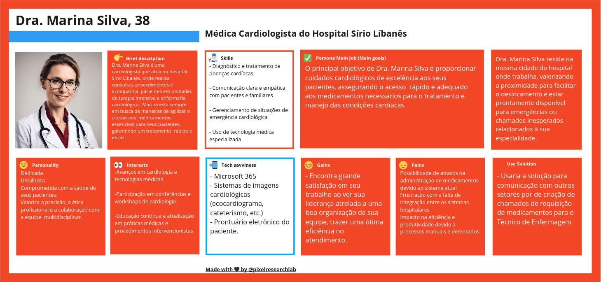
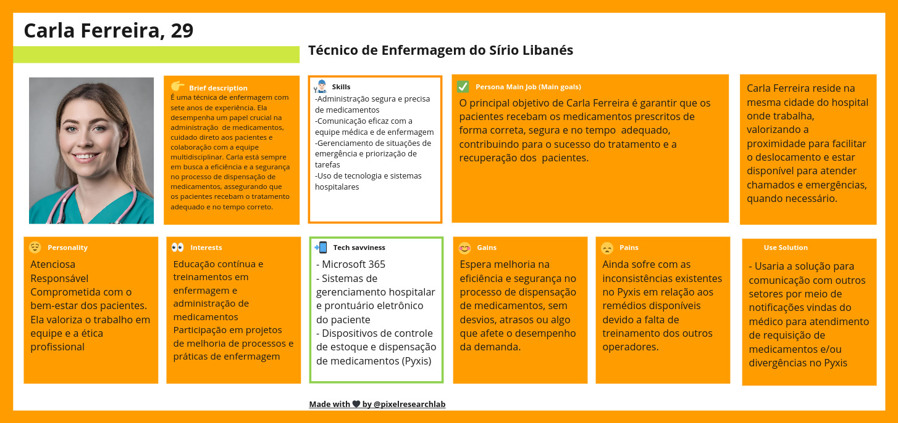
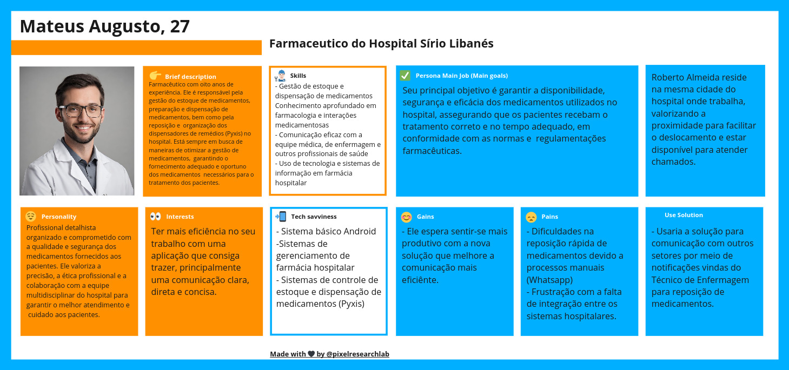

# Personas e User Stories

Uma persona é uma representação fictícia de um usuário típico de um produto, serviço ou sistema, baseada em dados reais e pesquisas sobre os usuários reais. O objetivo principal de criar uma persona é ajudar as equipes de desenvolvimento, marketing e design a entenderem melhor as necessidades, desejos, comportamentos e características dos usuários finais.

Mediante a problemática apresentada, foram pensadas 3 personas, cada uma com suas próprias necessidades específicas em relação ao uso da solução desenvolvida. Sendo assim, são elas:

* **Para maior riqueza de detalhes, acesso o link no fim dessa página**

## 1°Persona: Médica Cardiologista Dra.Marina Silva

### Breve Descrição

Dra. Marina Silva é uma cardiologista que atua no hospital Sírio Libanés, onde realiza consultas, procedimentos e acompanha  pacientes em unidades de terapia intensiva e enfermaria cardiológica.  Marina está sempre em busca de maneiras de agilizar o acesso aos  medicamentos essenciais para seus pacientes, garantindo um tratamento  rápido e eficaz.

### Skills

- Diagnóstico e tratamento de doenças cardíacas
- Comunicação clara e empática com pacientes e familiares
- Gerenciamento de situações de emergência cardiológica
- Uso de tecnologia médica especializada

### Seu objetivo

O principal objetivo de Dra. Marina Silva é proporcionar cuidados cardiológicos de excelência aos seus pacientes, assegurando o acesso  rápido e adequado aos medicamentos necessários para o tratamento e  manejo das condições cardíacas.

### Personalidade

- Dedicada
- Detalhista
- Comprometida com a saúde de seus pacientes.
- Valoriza a precisão, a ética profissional e a colaboração com a equipe  multidisciplinar.

### Interesses

- Avanços em cardiologia e tecnologias médicas
- Participação em conferências e workshops de cardiologia
- Educação contínua e atualização em práticas médicas e procedimentos intervencionistas

### Conhecimentos Tecnológicos

- Microsoft 365
- Sistemas de imagens cardiológicas (ecocardiograma, cateterismo, etc.)
- Prontuário eletrônico do paciente.

### Seus Ganhos

Encontra grande satisfação em seu trabalho ao ver sua liderança atrelada a uma boa organização de sua equipe, trazer uma ótima eficiência no atendimento.

### Suas Dores

Possibilidade de atrasos na administração de medicamentos devido ao sistema atual frustração com a falta de integração entre os sistemas hospitalares Impacto na eficiência e produtividade devido a processos manuais e demorados.

### Rotina

Dra. Marina Silva reside na mesma cidade do hospital onde trabalha, valorizando a proximidade para facilitar o deslocamento e estar  prontamente disponível para emergências ou chamados inesperados  relacionados à sua especialidade.

### Uso da Solução

Usaria a solução para comunicação com outros setores por de criação de chamados de requisição de medicamentos para o Técnico de Enfermagem

## 2°Persona: Técnica de Enfermagem Carla Ferreira 

### Breve Descrição
É uma técnica de enfermagem com sete anos de experiência. Ela desempenha um papel crucial na administração  de medicamentos, cuidado direto aos pacientes e colaboração com a equipe  multidisciplinar. Carla está sempre em busca a eficiência e a segurança no processo de dispensação de medicamentos, assegurando que  os pacientes recebam o tratamento adequado e no tempo correto.

### Skills

-Administração segura e precisa de medicamentos
-Comunicação eficaz com a equipe médica e de enfermagem
-Gerenciamento de situações de emergência e priorização de tarefas
-Uso de tecnologia e sistemas hospitalares

### Seu objetivo

O principal objetivo de Carla Ferreira é garantir que os pacientes recebam os medicamentos prescritos de forma correta, segura e no tempo  adequado, contribuindo para o sucesso do tratamento e a recuperação dos  pacientes.

### Personalidade

Atenciosa
Responsável
Comprometida com o bem-estar dos pacientes. Ela valoriza o trabalho em equipe e a ética profissional

### Interesses

Educação contínua e treinamentos em enfermagem e administração de medicamentos e de participação em projetos de melhoria de processos e práticas de enfermagem

### Conhecimentos Tecnológicos

- Microsoft 365
- Sistemas de gerenciamento hospitalar e prontuário eletrônico do paciente
- Dispositivos de controle de estoque e dispensação de medicamentos (Pyxis)

### Seus Ganhos

Espera melhoria na eficiência e segurança no processo de dispensação de medicamentos, sem desvios, atrasos ou algo que afete o desempenho da demanda.

### Suas Dores

Ainda sofre com as inconsistências existentes no Pyxis em relação aos remédios disponíveis devido a falta de treinamento dos outros operadores.

### Rotina

Carla Ferreira reside na mesma cidade do hospital onde trabalha, valorizando a proximidade para facilitar o deslocamento e estar  disponível para atender chamados e emergências, quando necessário.

### Uso da Solução

Usaria a solução para comunicação com outros setores por meio de notificações vindas do médico para atendimento de requisição de medicamentos e/ou divergências no Pyxis

## 3°Persona: Farmaceutico

### Breve Descrição

Farmacêutico com oito anos de experiência. Ele é responsável pela gestão do estoque de medicamentos,  preparação e dispensação de medicamentos, bem como pela reposição e  organização dos dispensadores de remédios (Pyxis) no hospital. Está sempre em busca de maneiras de otimizar a gestão de medicamentos,  garantindo o fornecimento adequado e oportuno dos medicamentos  necessários para o tratamento dos pacientes.

### Skills

- Gestão de estoque e dispensação de medicamentos
Conhecimento aprofundado em farmacologia e interações medicamentosas
- Comunicação eficaz com a equipe médica, de enfermagem e outros profissionais de saúde
- Uso de tecnologia e sistemas de informação em farmácia hospitalar

### Seu objetivo

Seu principal objetivo é garantir a disponibilidade, segurança e eficácia dos medicamentos utilizados no hospital, assegurando que os pacientes recebam o  tratamento correto e no tempo adequado, em conformidade com as normas e  regulamentações farmacêuticas.

### Personalidade

Profissional detalhista organizado e comprometido com a qualidade e segurança dos medicamentos fornecidos aos pacientes. Ele valoriza a  precisão, a ética profissional e a colaboração com a equipe  multidisciplinar do hospital para garantir o melhor atendimento e  cuidado aos pacientes.

### Interesses

Ter mais eficiência no seu trabalho com uma aplicação que consiga trazer, principalmente uma comunicação clara, direta e concisa.

### Conhecimentos Tecnológicos
 
- Sistema básico Android
-Sistemas de gerenciamento de farmácia hospitalar
- Sistemas de controle de estoque e dispensação de medicamentos (Pyxis)

### Seus Ganhos

Ele espera sentir-se mais produtivo com a nova solução que melhore a comunicação mais eficiênte.

### Suas Dores

- Dificuldades na reposição rápida de medicamentos devido a processos manuais (Whatsapp)
- Frustração com a falta de integração entre os sistemas hospitalares.

### Rotina

Roberto Almeida reside na mesma cidade do hospital onde trabalha, valorizando a proximidade para facilitar o deslocamento e estar  disponível para atender chamados.

### Uso da Solução

Usaria a solução para  comunicação com outros setores por meio de notificações vindas do Técnico de Enfermagem para reposição de medicamentos.

# Desenvolvimento

# Desenvolvimento

O desenvolvimento da Persona foi feito na plataforma Miro. Para consultar todas com maior nível de detalhes, segue o Link abaixo:

https://miro.com/app/board/uXjVKSJ_Dr0=/?share_link_id=442148356505